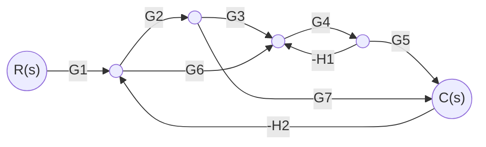

# VP6 — Masonovo pravilo (diagram poteka signalov)

**Datum:** 6. 5. 2026  
**Tema:** Poenostavitev diagrama poteka signalov z Masonovim pravilom

---

## Teorija — Masonovo pravilo

Masonovo pravilo uporabimo, ko želimo iz diagrama poteka signalov sistematicno dobiti prenosno funkcijo med vhodnim in izhodnim vozliscem.

### Splošna formula

$$
T = \frac{y_{izh}}{y_{vh}} = \frac{1}{\Delta}\sum_{i=1}^{M} P_i\,\Delta_i
$$

Kjer pomeni:

- $T$: prenosna funkcija med vhodnim in izhodnim vozeliscem
- $M$: stevilo direktnih poti od vhoda do izhoda
- $P_i$: ojacenje i-te direktne poti
- $\Delta$: determinanta celotnega diagrama
- $\Delta_i$: determinanta dela diagrama, ki se **ne dotika** i-te direktne poti

Determinanta diagrama je:

$$
\Delta = 1 - \sum P_{j1} + \sum P_{j2} - \sum P_{j3} + \cdots
$$

- $\sum P_{j1}$: vsota ojacenj vseh posameznih povratnih zank
- $\sum P_{j2}$: vsota produktov ojacenj dveh nedotikajocih se zank
- $\sum P_{j3}$: vsota produktov ojacenj treh nedotikajocih se zank, itd.

Pomembno: Masonovo pravilo velja za zvezo med **vhodnim** in **izhodnim** vozeliscem.

---

## Resen primer — poenostavitev SFG

### Diagram (Mermaid)

### Postopek korak za korakom

1. Doloci vhodno in izhodno vozlisce.
V tem primeru je vhod $R(s)$ in izhod $C(s)$. Masonovo pravilo uporabimo samo med tema dvema vozliscema.

2. Najdi vse direktne poti od vhoda do izhoda.
Direktna pot je pot, po kateri gremo od $R(s)$ do $C(s)$ brez ponovnega obiska istega vozlisca.

3. Za vsako direktno pot izracunaj ojacenje $P_i$.
To je produkt vseh prenosnih funkcij na tej poti.

4. Najdi vse povratne zanke in njihova ojacenja.
Povratna zanka je zaprta pot, ki se zacne in konca v istem vozliscu. Oznake $-H_1$ in $-H_2$ prispevajo negativen predznak k ojacenju zanke.

5. Najdi vse kombinacije nedotikajocih se zank.
Zanki sta nedotikajoci, ce nimata nobenega skupnega vozlisca. V tem primeru dobimo eno kombinacijo dveh nedotikajocih zank: $P_{12}=P_{11}P_{21}$.

6. Sestavi determinanto diagrama $\Delta$.
Uporabimo pravilo izmenicnih predznakov:

$$
\Delta = 1 - (\text{vsota vseh posameznih zank}) + (\text{vsota produktov dveh nedotikajocih zank}) - \cdots
$$

7. Izracunaj $\Delta_i$ za vsako direktno pot.
Pri i-ti poti odstranis vse zanke, ki se te poti dotikajo, nato pa iz preostalih zank sestavis determinanto.

Za $P_1 = G_1G_2G_3G_4G_5$:
pot vsebuje vozlisca in veje, ki jih uporabljajo zanke $P_{11}$, $P_{21}$, $P_{31}$ in $P_{41}$, zato se vse zanke dotikajo poti $P_1$. Ne ostane nobena zanka, zato je $\Delta_1 = 1$.

Za $P_2 = G_1G_6G_4G_5$:
tudi ta pot se dotika vseh zank (z $P_{11}$ deli del okoli $G_4$, z ostalimi pa vozlisca preko veje do $C(s)$ in povratne veje $-H_2$), zato po odstranitvi spet ne ostane nobena zanka. Sledi $\Delta_2 = 1$.

Za $P_3 = G_1G_2G_7$:
ta pot se dotika zank $P_{21}$, $P_{31}$ in $P_{41}$, ne dotika pa se zanke $P_{11}$ (lokalne zanke okoli $G_4$). Zato po odstranitvi ostane samo $P_{11}$ in dobimo:

$$
\Delta_3 = 1 - P_{11}
$$

Koncni rezultat za ta primer je torej:

$$
\Delta_1 = 1,\qquad \Delta_2 = 1,\qquad \Delta_3 = 1 - P_{11}
$$

8. Vstavi v Masonovo formulo.

$$
\frac{C(s)}{R(s)} = \frac{1}{\Delta}\sum_{i=1}^{M} P_i\Delta_i
$$

S tem dobis koncno zaprtozancno prenosno funkcijo.

Za diagram z vejami $G_1,\dots,G_7$ in povratnima clenoma $-H_1, -H_2$ dobimo tri direktne poti:

$$
P_1 = G_1G_2G_3G_4G_5,\qquad
P_2 = G_1G_6G_4G_5,\qquad
P_3 = G_1G_2G_7
$$

Povratne zanke:

$$
P_{11} = -G_4H_1
$$

$$
P_{21} = -G_2G_7H_2
$$

$$
P_{31} = -G_6G_4G_5H_2
$$

$$
P_{41} = -G_2G_3G_4G_5H_2
$$

Nedotikajoci se zanki sta $P_{11}$ in $P_{21}$, zato:

$$
P_{12} = P_{11}P_{21}
$$

Determinanta celotnega diagrama:

$$
\Delta = 1 - (P_{11}+P_{21}+P_{31}+P_{41}) + P_{12}
$$

Za poti velja:

$$
\Delta_1 = 1,\qquad \Delta_2 = 1,\qquad \Delta_3 = 1 - P_{11}
$$

Zato je zaprtozancna prenosna funkcija:

$$
\frac{C(s)}{R(s)} = \frac{1}{\Delta}\left(P_1\Delta_1 + P_2\Delta_2 + P_3\Delta_3\right)
$$

$$
\frac{C(s)}{R(s)} =
\frac{G_1G_2G_3G_4G_5 + G_1G_6G_4G_5 + G_1G_2G_7(1+G_4H_1)}
{1 + G_4H_1 + G_2G_7H_2 + G_6G_4G_5H_2 + G_2G_3G_4G_5H_2 + G_4H_1G_2G_7H_2}
$$

To je ekvivalentna prenosna funkcija celotne blokovne sheme med $R(s)$ in $C(s)$.

---

*VP6 — Diskretni krmilni sistemi*
