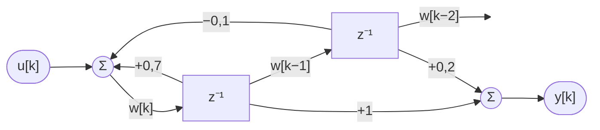

# Izpit — Rešitve (INTERNO — za pedagoško osebje)

---

## 1. naloga — Diskretna konvolucija

### 1.1 Konvolucijska tabela — rampni vhod (15 točk)

Najprej iz diferenčne enačbe izračunamo impulzni odziv $h[k]$ (vhod $x[k]=\delta[k]$, $h[-1]=0$):

| $k$ | $h[k] = 0{,}6\,h[k-1] + \delta[k]$ | $h[k]$ |
|-----|------|--------|
| 0 | $0{,}6 \cdot 0 + 1$ | **1** |
| 1 | $0{,}6 \cdot 1$ | **0,6** |
| 2 | $0{,}6 \cdot 0{,}6$ | **0,36** |
| 3 | $0{,}6 \cdot 0{,}36$ | **0,216** |
| 4 | $0{,}6 \cdot 0{,}216$ | **0,1296** |

Konvolucijska vsota $y[k] = \sum_{m=0}^{k} h[m]\,x_1[k-m]$ z $x_1[k]=k$:

| $k$ | $h[0]{\cdot}x_1[k]$ | $h[1]{\cdot}x_1[k{-}1]$ | $h[2]{\cdot}x_1[k{-}2]$ | $h[3]{\cdot}x_1[k{-}3]$ | $y[k]$ |
|-----|------|------|------|------|--------|
| 0 | $1{\cdot}0$ | — | — | — | **0** |
| 1 | $1{\cdot}1$ | $0{,}6{\cdot}0$ | — | — | **1** |
| 2 | $1{\cdot}2$ | $0{,}6{\cdot}1$ | $0{,}36{\cdot}0$ | — | **2,6** |
| 3 | $1{\cdot}3$ | $0{,}6{\cdot}2$ | $0{,}36{\cdot}1$ | $0{,}216{\cdot}0$ | **4,56** |
| 4 | $1{\cdot}4$ | $0{,}6{\cdot}3$ | $0{,}36{\cdot}2$ | $0{,}216{\cdot}1$ | **6,736** |

### 1.2 Ustaljeno stanje pri stopničnem vhodu (10 točk)

$y[\infty] - 0{,}6\,y[\infty] = 1 \;\Rightarrow\; y[\infty](1-0{,}6) = 1$

$$\boxed{y[\infty] = \frac{1}{0{,}4} = 2{,}5}$$

---

## 2. naloga — Inverzna Z transformacija

### 2.1 Delni ulomki (15 točk)

$$\frac{X(z)}{z} = \frac{1}{(z-1)(z-0{,}8)} = \frac{A}{z-1} + \frac{B}{z-0{,}8}$$

$$A = \left.\frac{1}{z-0{,}8}\right|_{z=1} = \frac{1}{0{,}2} = 5, \qquad B = \left.\frac{1}{z-1}\right|_{z=0{,}8} = \frac{1}{-0{,}2} = -5$$

Pomnožimo z $z$ in uporabimo $\mathcal{Z}\{a^k u[k]\} = \frac{z}{z-a}$:

$$X(z) = \frac{5z}{z-1} - \frac{5z}{z-0{,}8} \;\Rightarrow\; \boxed{x[k] = 5\bigl(1 - (0{,}8)^k\bigr)\,u[k]}$$

### 2.2 Numerične vrednosti (10 točk)

| $k$ | $5(1-(0{,}8)^k)$ | $x[k]$ |
|-----|--------------------------|--------|
| 0 | $5(1-1)$ | **0** |
| 1 | $5(1-0{,}8)$ | **1** |
| 2 | $5(1-0{,}64)$ | **1,8** |
| 3 | $5(1-0{,}512)$ | **2,44** |
| 4 | $5(1-0{,}4096)$ | **2,952** |

Signal eksponentno konvergira k $x[\infty] = 5$.

---

## 3. naloga — Routh-Hurwitzov kriterij

### 3.1 Routhova tabela (15 točk)

Koeficienti $P(s) = s^3 + 4s^2 + 3s + K$: $a_3=1,\ a_2=4,\ a_1=3,\ a_0=K$.

| Vrstica | Stolpec 1 | Stolpec 2 |
|---------|-----------|-----------|
| $s^3$   | $1$       | $3$       |
| $s^2$   | $4$       | $K$       |
| $s^1$   | $\dfrac{4 \cdot 3 - 1 \cdot K}{4} = \dfrac{12-K}{4}$ | $0$ |
| $s^0$   | $K$       |           |

### 3.2 Območje stabilnosti (10 točk)

| Pogoj | Neenačba | Rezultat |
|-------|----------|---------|
| $K > 0$ | $K>0$ | $K>0$ |
| $\dfrac{12-K}{4} > 0$ | $12-K>0$ | $K<12$ |

$$\boxed{0 < K < 12}$$

---

## 4. naloga — Realizacija prenosne funkcije

### 4.1 Indirektna metoda — diferenčni enačbi (8 točk)

Delimo z $z^2$: $H(z) = \dfrac{z^{-1} + 0{,}2\,z^{-2}}{1 - 0{,}7\,z^{-1} + 0{,}1\,z^{-2}}$.

Uvedemo $W(z) = \dfrac{U(z)}{1 - 0{,}7z^{-1} + 0{,}1z^{-2}}$, tako da $Y(z) = (z^{-1} + 0{,}2z^{-2})\,W(z)$:

$$\boxed{w[k] = 0{,}7\,w[k-1] - 0{,}1\,w[k-2] + u[k]}, \qquad \boxed{y[k] = w[k-1] + 0{,}2\,w[k-2]}$$

### 4.2 Blokovna shema (7 točk)

### 4.3 Odziv na stopnico (5 točk)

$u[k]=1$ ($k\geq 0$), $w[-1]=w[-2]=0$:

| $k$ | $u[k]$ | $w[k]$   | $y[k]$   |
|:---:|:------:|:--------:|:--------:|
| $0$ | $1$ | $1$ | $0$ |
| $1$ | $1$ | $1{,}7$ | $1$ |
| $2$ | $1$ | $2{,}09$ | $1{,}9$ |
| $3$ | $1$ | $2{,}293$ | $2{,}43$ |
| $4$ | $1$ | $2{,}3961$ | $2{,}711$ |

Primer za $k=2$: $w[2] = 0{,}7\cdot 1{,}7 - 0{,}1\cdot 1 + 1 = 2{,}09$; $\;y[2] = 1{,}7 + 0{,}2\cdot 1 = 1{,}9$.

### 4.4 Poli, stabilnost in ustaljena vrednost (5 točk)

$z^2 - 0{,}7z + 0{,}1 = 0 \Rightarrow z = \dfrac{0{,}7 \pm \sqrt{0{,}49-0{,}4}}{2} = \dfrac{0{,}7 \pm 0{,}3}{2}$, torej $z_1 = 0{,}5,\ z_2 = 0{,}2$.

$$|z_{1,2}| < 1 \;\Rightarrow\; \boxed{\text{Sistem je STABILEN.}}$$

$$y[\infty] = H(1) = \frac{1 + 0{,}2}{1 - 0{,}7 + 0{,}1} = \frac{1{,}2}{0{,}4} = \boxed{3}$$
