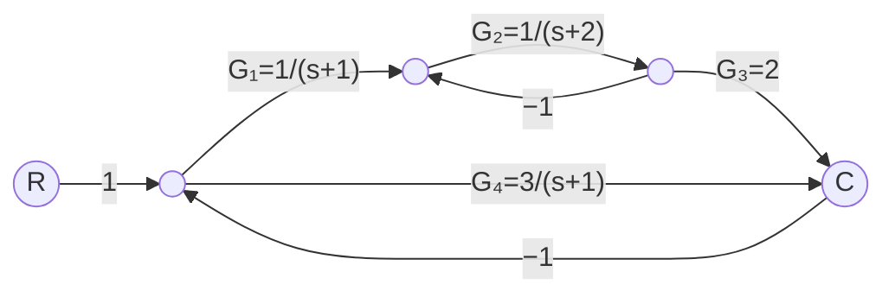

# Kolokvij II — Diskretni krmilni sistemi

**Datum:** 25. 5. 2026 &emsp; **Trajanje:** 60 min &emsp; **Ime in priimek / Vpisna št.:** ___________________________________

*Dovoljeni pripomočki: zapiski, kalkulator. Elektronske naprave s spletno povezavo niso dovoljene.*

---

## 1. Routh-Hurwitzov kriterij (25 točk)

Dan je zaprtozančni sistem z ojačenjem $K > 0$: $G(s) = \dfrac{K}{s(s+1)(s+2)}$, karakteristični polinom: $P(s) = s^3 + 3s^2 + 2s + K$.

1. **(15 točk)** Sestavite popolno Routhovo tabelo za polinom $P(s)$.
2. **(10 točk)** Z analizo prvega stolpca določite območje ojačenja $K$, za katero je sistem stabilen.

---

## 2. Masonovo pravilo (25 točk)

Dan je diagram poteka signalov:

1. **(8 točk)** Naštejte vse direktne poti od $R$ do $C$ in izračunajte ojačenje vsake poti $P_i$.
2. **(8 točk)** Naštejte vse povratne zanke in ojačenja $L_j$. Identificirajte nedotikajoče se pare zank in izračunajte njihove produkte.
3. **(9 točk)** Izračunajte $\Delta$ in kofaktorje $\Delta_i$, nato zapišite prenosno funkcijo $T = \dfrac{C}{R} = \dfrac{1}{\Delta}\sum_i P_i\,\Delta_i$.

---

## 3. Realizacija prenosne funkcije (25 točk)

Dana je diskretna prenosna funkcija: $H(z) = \dfrac{Y(z)}{U(z)} = \dfrac{z + 0{,}5}{z^2 - z + 0{,}25}$

1. **(8 točk)** Z **indirektno metodo** uvedite $W(z) = \dfrac{U(z)}{D(z)}$, kjer $D(z) = z^2 - z + 0{,}25$, in zapišite diferenčni enačbi za $w[k]$ in $y[k]$.
2. **(7 točk)** Narišite blokovno shemo realizacije z dvema zakasnilnima členoma $z^{-1}$.
3. **(5 točk)** Z enačbama iz točke 1 izračunajte $w[k]$ in $y[k]$ za $k = 0,1,2,3,4$ pri $u[k]=1$ ($k\geq 0$) in $w[-1]=w[-2]=0$.
4. **(5 točk)** Poiščite pole $H(z)$, ugotovite stabilnost in izračunajte $y[\infty]$.

---

## 4. Juryjev stabilnostni kriterij (25 točk)

Dan je karakteristični polinom: $P(z) = z^3 - 0{,}5\,z^2 + 0{,}3\,z + 0{,}5$, koeficienti: $a_0=1,\ a_1=-0{,}5,\ a_2=0{,}3,\ a_3=0{,}5$.

1. **(10 točk)** Preverite tri nujne pogoje: $P(1)>0$, $\;(-1)^n P(-1)>0$, $\;|a_n|<a_0$. Kaj pomeni, če kateri ni izpolnjen?

2. **(10 točk)** Sestavite Juryjevo tabelo in izračunajte elemente $b_k$ in $c_k$:
$$b_k = a_n \cdot a_{k+1} - a_0 \cdot a_{n-1-k}, \qquad c_k = b_{n-1} \cdot b_{k+1} - b_0 \cdot b_{n-2-k}$$

3. **(5 točk)** Preverite stabilnostne pogoje $|b_{n-1}|>|b_0|$ in $|c_{n-2}|>|c_0|$. Ali je sistem stabilen?

---

*Skupaj: ______ / 100 točk*
