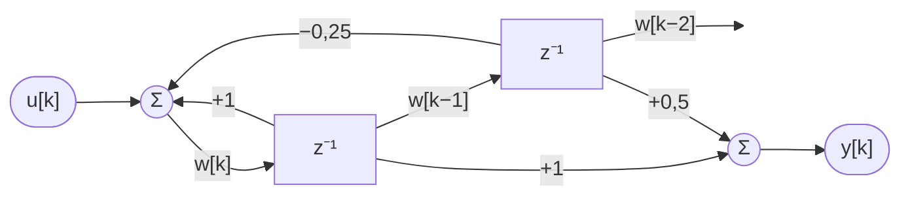

# Kolokvij II — Rešitve (INTERNO — za pedagoško osebje)

---

## 1. naloga — Routh-Hurwitzov kriterij

### 1.1 Routhova tabela (15 točk)

Polinom: $P(s) = s^3 + 3s^2 + 2s + K$

Koeficienti: $a_3=1,\ a_2=3,\ a_1=2,\ a_0=K$

| Vrstica | Stolpec 1 | Stolpec 2 |
|---------|-----------|-----------|
| $s^3$   | $1$       | $2$       |
| $s^2$   | $3$       | $K$       |
| $s^1$   | $\dfrac{3 \cdot 2 - 1 \cdot K}{3} = \dfrac{6-K}{3}$ | $0$ |
| $s^0$   | $K$       |           |

### 1.2 Območje stabilnosti (10 točk)

| Pogoj | Neenačba | Rezultat |
|-------|----------|---------|
| $K > 0$ | $K > 0$ | $K > 0$ |
| $\dfrac{6-K}{3} > 0$ | $6 - K > 0$ | $K < 6$ |

$$\boxed{0 < K < 6}$$

---

## 2. naloga — Masonovo pravilo

### Direktne poti (8 točk)

| Pot | Zaporedje vozlišč | Ojačenje $P_i$ |
|-----|-------------------|----------------|
| $P_1$ | $R \to a \to b \to c \to C$ | $G_1 G_2 G_3 = \dfrac{1}{s+1} \cdot \dfrac{1}{s+2} \cdot 2 = \dfrac{2}{(s+1)(s+2)}$ |
| $P_2$ | $R \to a \to C$ | $G_4 = \dfrac{3}{s+1}$ |

### Povratne zanke (8 točk)

| Zanka | Vozlišča | Ojačenje $L_j$ |
|-------|----------|----------------|
| $L_1$ | $b \to c \to b$ | $G_2(-H_1) = \dfrac{1}{s+2} \cdot (-1) = -\dfrac{1}{s+2}$ |
| $L_2$ | $a \to b \to c \to C \to a$ | $G_1 G_2 G_3 (-H_2) = -\dfrac{2}{(s+1)(s+2)}$ |
| $L_3$ | $a \to C \to a$ | $G_4(-H_2) = -\dfrac{3}{s+1}$ |

**Nedotikujoče se zanke:**

- $L_1$ (vozlišči $b, c$) in $L_3$ (vozlišči $a, C$) — **nimata skupnega vozlišča** → nedotikujoče se ✓
- $L_1$ in $L_2$: delita $b, c$ → se dotikata
- $L_2$ in $L_3$: delita $a, C$ → se dotikata

$$P_{13} = L_1 \cdot L_3 = \left(-\frac{1}{s+2}\right)\!\left(-\frac{3}{s+1}\right) = \frac{3}{(s+1)(s+2)}$$

### Determinanta in prenosna funkcija (9 točk)

$$\Delta = 1 - (L_1+L_2+L_3) + P_{13} = 1 + \frac{1}{s+2} + \frac{2}{(s+1)(s+2)} + \frac{3}{s+1} + \frac{3}{(s+1)(s+2)}$$

Množimo z $(s+1)(s+2)$:

$$\Delta \cdot (s+1)(s+2) = (s+1)(s+2) + (s+1) + 2 + 3(s+2) + 3 = s^2+7s+14$$

$$\Delta = \frac{s^2+7s+14}{(s+1)(s+2)}$$

**Kofaktor $\Delta_1$** — $P_1$ poteka skozi $a,b,c,C$; vse zanke se je dotikajo:

$$\Delta_1 = 1$$

**Kofaktor $\Delta_2$** — $P_2$ poteka skozi $a, C$:

$L_1(b,c)$: vozlišči $b, c$ **nista** na $P_2$ → nedotikujoča se → ostane

$L_2, L_3$: se dotikata $P_2$ → izločimo

$$\Delta_2 = 1 - L_1 = 1 + \frac{1}{s+2} = \frac{s+3}{s+2}$$

**Prenosna funkcija:**

$$T(s) = \frac{C}{R} = \frac{P_1\Delta_1 + P_2\Delta_2}{\Delta} = \frac{\dfrac{2}{(s+1)(s+2)} + \dfrac{3}{s+1}\cdot\dfrac{s+3}{s+2}}{\dfrac{s^2+7s+14}{(s+1)(s+2)}}$$

Množimo števec z $(s+1)(s+2)$:

$$\text{Števec} = 2 + 3(s+3) = 3s + 11$$

$$\boxed{T(s) = \frac{3s+11}{s^2+7s+14}}$$

---

## 3. naloga — Realizacija prenosne funkcije

### 3.1 Indirektna metoda — diferenčni enačbi (8 točk)

$$H(z) = \frac{z + 0{,}5}{z^2 - z + 0{,}25} = \frac{N(z)}{D(z)}$$

Delimo števec in imenovalec z $z^2$:

$$H(z) = \frac{z^{-1} + 0{,}5\,z^{-2}}{1 - z^{-1} + 0{,}25\,z^{-2}}$$

Uvedemo pomožno spremenljivko $W(z) = \dfrac{U(z)}{1 - z^{-1} + 0{,}25\,z^{-2}}$, tako da velja $Y(z) = (z^{-1} + 0{,}5\,z^{-2})\,W(z)$.

**Enačba za $w[k]$** — iz $W(z)(1 - z^{-1} + 0{,}25\,z^{-2}) = U(z)$:

$$\boxed{w[k] = w[k-1] - 0{,}25\,w[k-2] + u[k]}$$

**Enačba za $y[k]$** — iz $Y(z) = z^{-1}W(z) + 0{,}5\,z^{-2}W(z)$:

$$\boxed{y[k] = w[k-1] + 0{,}5\,w[k-2]}$$

### 3.2 Blokovna shema (7 točk)

### 3.3 Odziv na stopnico (5 točk)

Stopnični vhod: $u[k] = 1$ za $k \geq 0$, začetni pogoji: $w[-1] = w[-2] = 0$.

| $k$ | $u[k]$ | $w[k]$   | $y[k]$   |
|:---:|:------:|:--------:|:--------:|
| $0$ | $1$    | $1$      | $0$      |
| $1$ | $1$    | $2$      | $1$      |
| $2$ | $1$    | $2{,}75$ | $2{,}5$  |
| $3$ | $1$    | $3{,}25$ | $3{,}75$ |
| $4$ | $1$    | $3{,}5625$ | $4{,}625$ |

Primer za $k=2$: $w[2] = 2 - 0{,}25 \cdot 1 + 1 = 2{,}75$; $\quad y[2] = 2 + 0{,}5 \cdot 1 = 2{,}5$

### 3.4 Poli, stabilnost in ustaljena vrednost (5 točk)

Imenovalec: $z^2 - z + 0{,}25 = (z - 0{,}5)^2 = 0$

$$z_{1,2} = 0{,}5 \quad \text{(dvojni pol)}$$

$$|z_{1,2}| = 0{,}5 < 1 \quad \Rightarrow \quad \boxed{\text{Sistem je STABILEN.}}$$

Ustaljena vrednost (izrek o končni vrednosti):

$$y[\infty] = H(1) = \frac{1 + 0{,}5}{1 - 1 + 0{,}25} = \frac{1{,}5}{0{,}25} = \boxed{6}$$

---

## 4. naloga — Juryjev stabilnostni kriterij

$P(z) = z^3 - 0{,}5z^2 + 0{,}3z + 0{,}5$, koeficienti: $a_0=1,\ a_1=-0{,}5,\ a_2=0{,}3,\ a_3=0{,}5$

### 4.1 Nujni pogoji (10 točk)

| Pogoj | Izračun | Izpolnjen? |
|-------|---------|:----------:|
| $P(1) > 0$ | $1 - 0{,}5 + 0{,}3 + 0{,}5 = 1{,}3 > 0$ | ✓ |
| $(-1)^3 P(-1) > 0$ | $-(-1 - 0{,}5 - 0{,}3 + 0{,}5) = -(-1{,}3) = 1{,}3 > 0$ | ✓ |
| $\|a_3\| < a_0$ | $0{,}5 < 1$ | ✓ |

Vsi nujni pogoji so izpolnjeni — nadaljujemo z gradnjo Juryjeve tabele. Če kateri ne bi bil izpolnjen, bi bil sistem takoj **nestabilen** (tabele ne bi bilo treba graditi).

### 4.2 Juryjeva tabela (10 točk)

| Vrstica | $z^0$ | $z^1$ | $z^2$ | $z^3$ |
|---------|-------|-------|-------|-------|
| 1 | $a_3 = 0{,}5$ | $a_2 = 0{,}3$ | $a_1 = -0{,}5$ | $a_0 = 1$ |
| 2 | $a_0 = 1$ | $a_1 = -0{,}5$ | $a_2 = 0{,}3$ | $a_3 = 0{,}5$ |
| 3 | $b_2$ | $b_1$ | $b_0$ | |
| 4 | $b_0$ | $b_1$ | $b_2$ | |
| 5 | $c_1$ | $c_0$ | | |

**Izračun $b_k$:**

$$b_0 = a_3 \cdot a_1 - a_0 \cdot a_2 = 0{,}5 \cdot (-0{,}5) - 1 \cdot 0{,}3 = -0{,}25 - 0{,}3 = -0{,}55$$

$$b_1 = a_3 \cdot a_2 - a_0 \cdot a_1 = 0{,}5 \cdot 0{,}3 - 1 \cdot (-0{,}5) = 0{,}15 + 0{,}5 = 0{,}65$$

$$b_2 = a_3^2 - a_0^2 = 0{,}25 - 1 = -0{,}75$$

**Izračun $c_k$:**

$$c_0 = b_2 \cdot b_1 - b_0 \cdot b_1 = b_1(b_2 - b_0) = 0{,}65 \cdot (-0{,}75 - (-0{,}55)) = 0{,}65 \cdot (-0{,}2) = -0{,}13$$

$$c_1 = b_2^2 - b_0^2 = 0{,}75^2 - 0{,}55^2 = 0{,}5625 - 0{,}3025 = 0{,}26$$

### 4.3 Stabilnostni pogoji in zaključek (5 točk)

| Pogoj | Vrednosti | Izpolnjen? |
|-------|-----------|:----------:|
| $\|b_2\| > \|b_0\|$ | $0{,}75 > 0{,}55$ | ✓ |
| $\|c_1\| > \|c_0\|$ | $0{,}26 > 0{,}13$ | ✓ |

$$\boxed{\text{Sistem je STABILEN.}}$$

Vsi poli karakterističnega polinoma $P(z)$ leže znotraj enotske krožnice ($|z_i| < 1$).
